# 📄 Resume Builder

A modern full-stack Resume Builder web application that allows users to create professional, ATS-friendly resumes through a simple step-by-step process.

Users can register, log in, enter their personal and professional information, select a resume template, preview their resume, and download the final resume as a PDF.

---

## 🚀 Project Overview

The Resume Builder provides an easy-to-use interface for creating professional resumes without requiring any design skills.

The application follows a structured 8-step resume creation process and provides multiple resume templates.

---

## ✨ Features

### 🔐 Authentication
- User Registration
- User Login
- Forgot Password
- Password Reset
- Remember Me

### 📊 Dashboard
- Total Resumes
- Profile Completion
- Account Status
- Create Resume
- My Resumes
- Analytics
- Logout

### 📝 Resume Builder

Users can create a resume step by step:

1. Personal Information
2. Education
3. Work Experience
4. Skills
5. Projects
6. Certifications
7. Languages
8. Template Selection

### 👤 Personal Information
- Full Name
- Email Address
- Phone Number
- Address
- LinkedIn Profile
- GitHub Profile
- Career Objective

### 🎓 Education
- Degree
- College
- University
- Start Year
- End Year
- CGPA / Percentage
- Multiple Education Entries

### 💼 Work Experience
- Company Name
- Job Title
- Employment Type
- Start Date
- End Date
- Current Job Option
- Responsibilities and Achievements
- Multiple Experience Entries

### 🛠 Skills
- Add Multiple Skills
- Skill Level
- Beginner
- Intermediate
- Advanced
- Expert

### 💻 Projects
- Project Title
- Technology Used
- GitHub Repository Link
- Live Demo Link
- Project Description
- Multiple Projects

### 🏆 Certifications
- Certificate Name
- Issuing Organization
- Issue Date
- Certificate ID
- Certificate URL
- Multiple Certifications

### 🌐 Languages
- Language
- Proficiency Level
- Multiple Languages

### 🎨 Resume Templates

The application provides multiple resume templates:

- Modern
- Professional
- Creative
- Minimal

### 👁 Resume Preview
- Preview completed resume
- Edit resume
- Save resume
- Download PDF
- Return to Dashboard

---

## 🔄 Application Flow

The complete application flow is:

```text
Home Page
   ↓
Login Page
   ↓
Dashboard
   ↓
Create Resume
   ↓
Personal Information
   ↓
Education
   ↓
Work Experience
   ↓
Skills
   ↓
Projects
   ↓
Certifications
   ↓
Languages
   ↓
Template Selection
   ↓
Resume Preview
   ↓
Download PDF
```

---

## 📸 Project Screenshots

### 1. Home Page

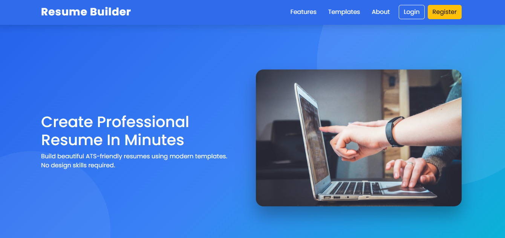

### 2. Login Page

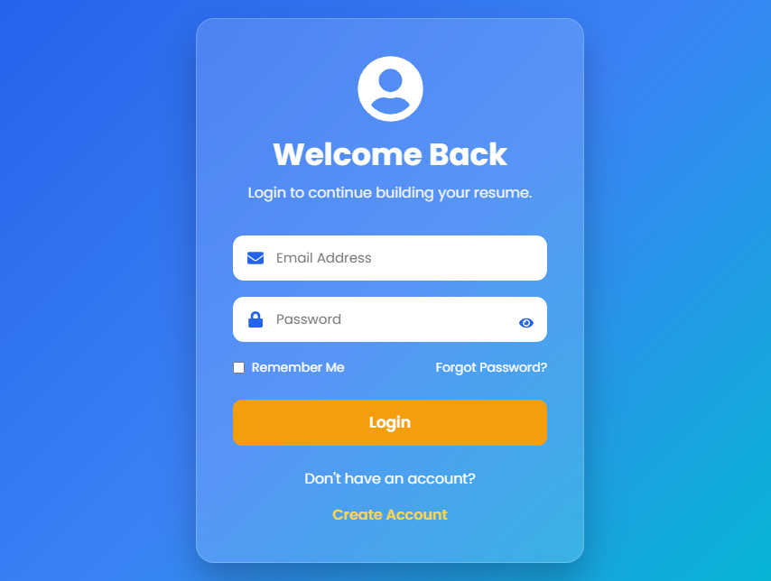

### 3. Create Account

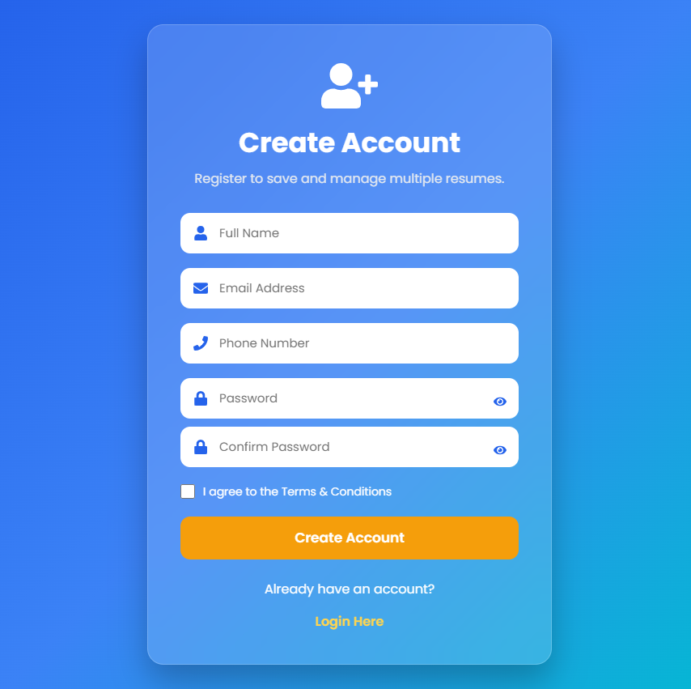

### 4. Forgot Password

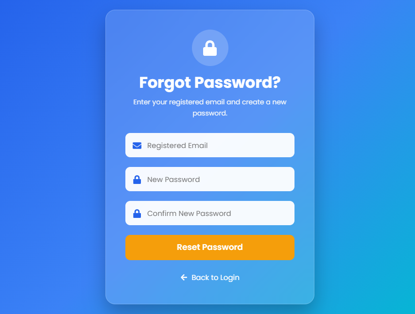

### 5. Dashboard

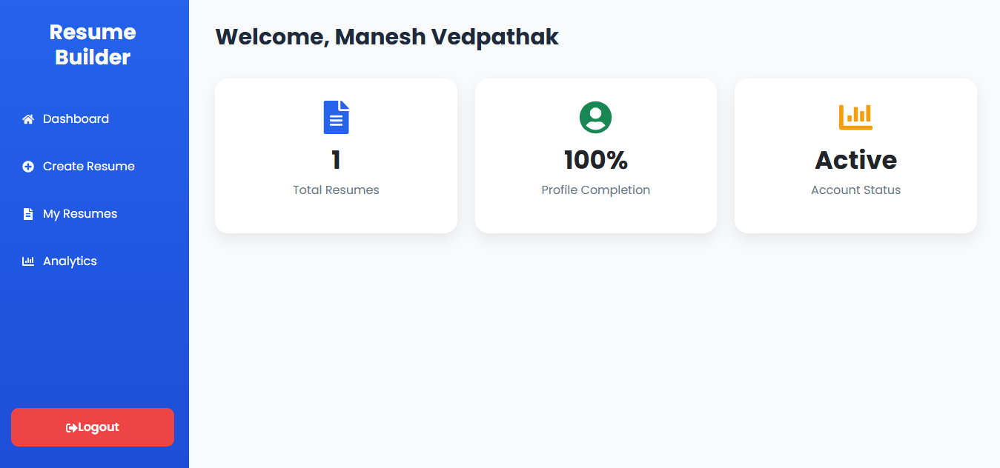

### 6. Personal Information

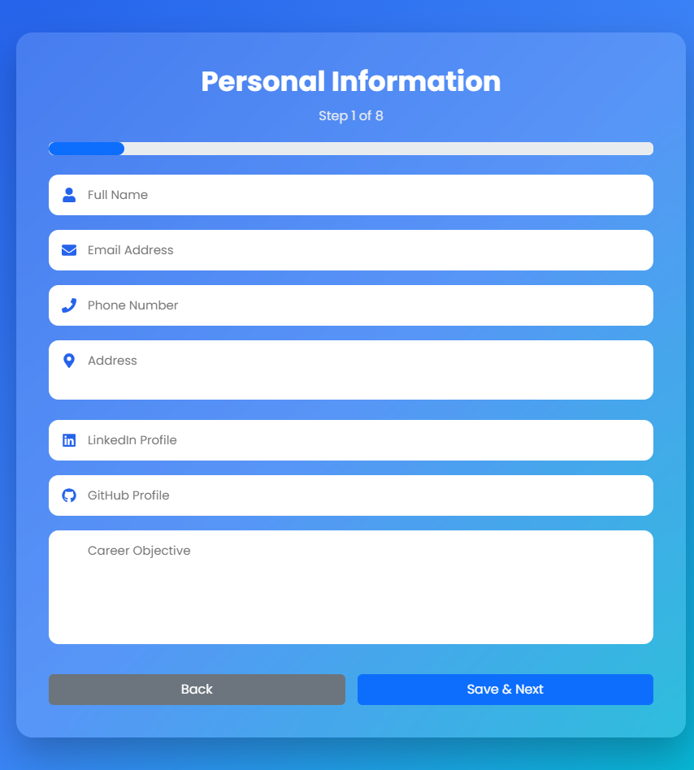

### 7. Education

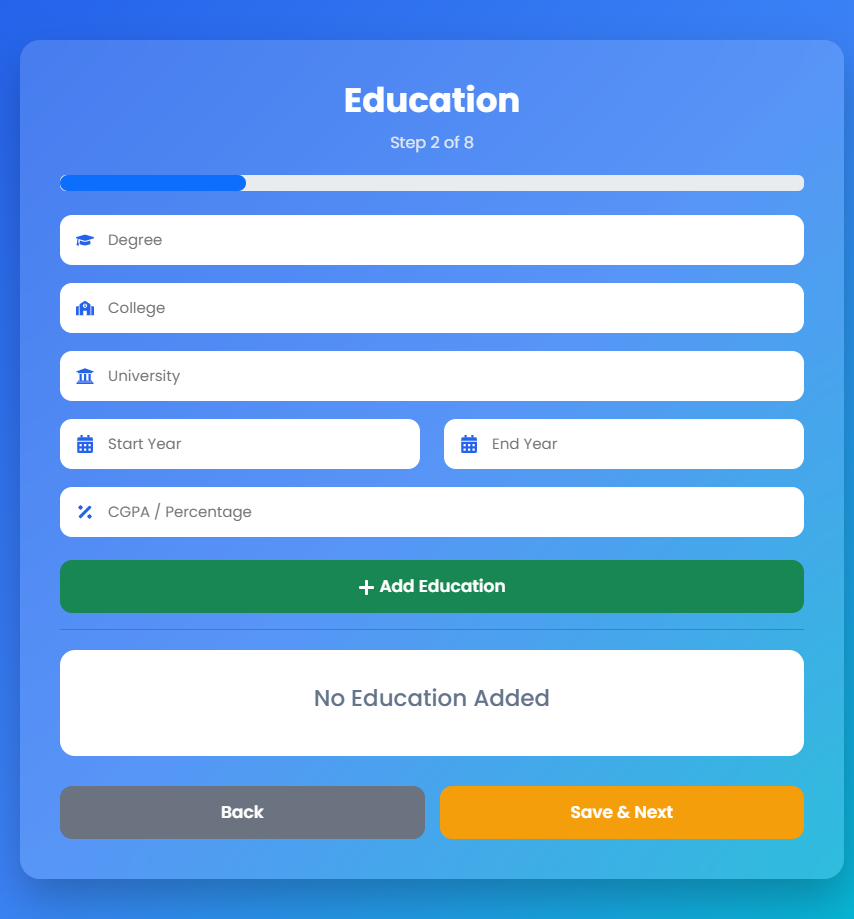

### 8. Work Experience

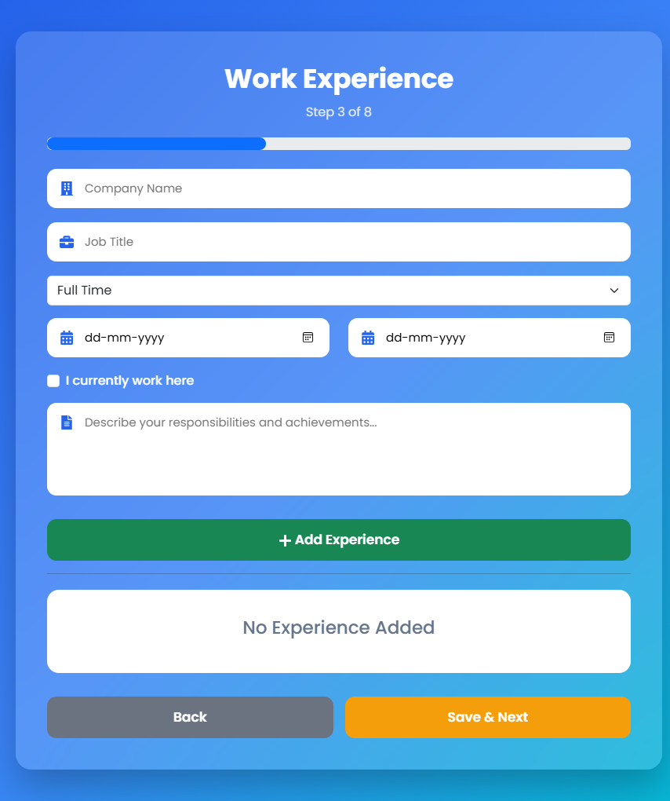

### 9. Skills

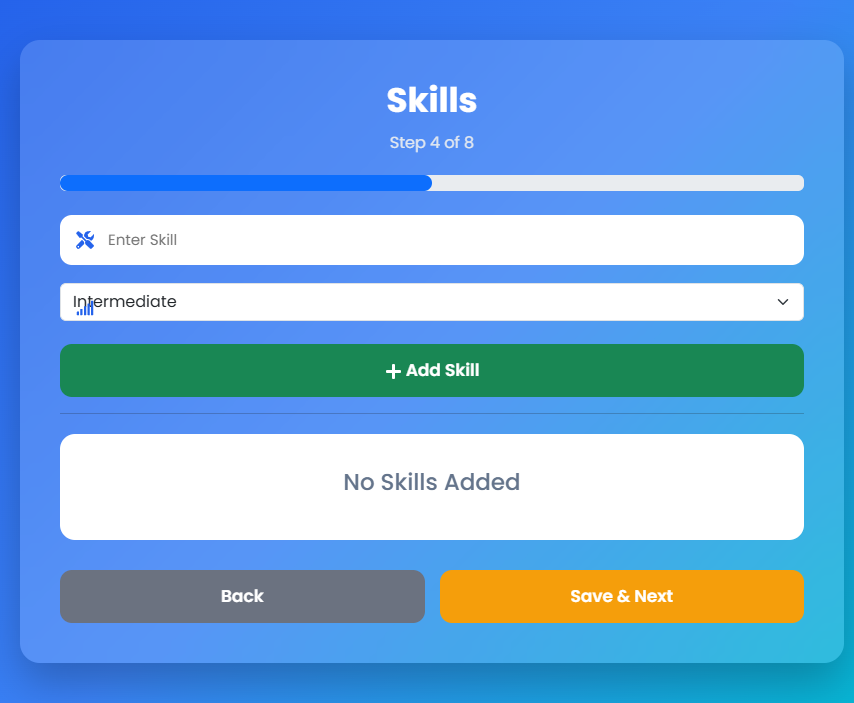

### 10. Projects


### 11. Certifications

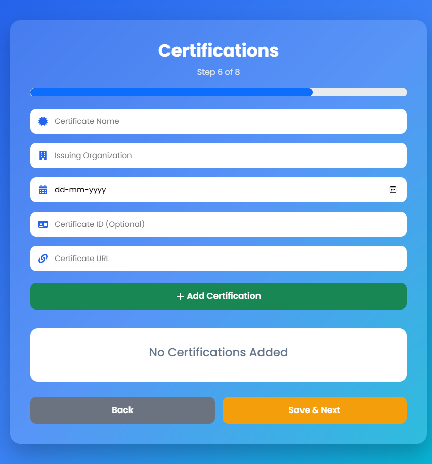

### 12. Languages

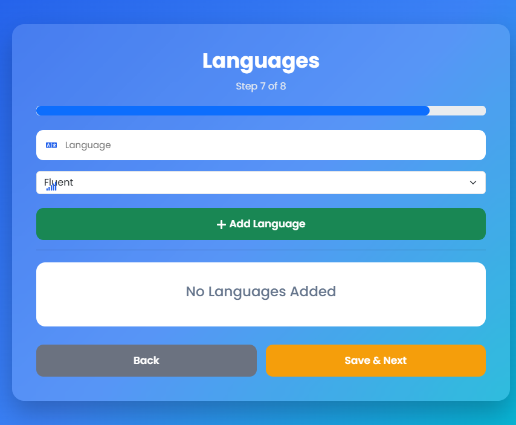

### 13. Template Selection

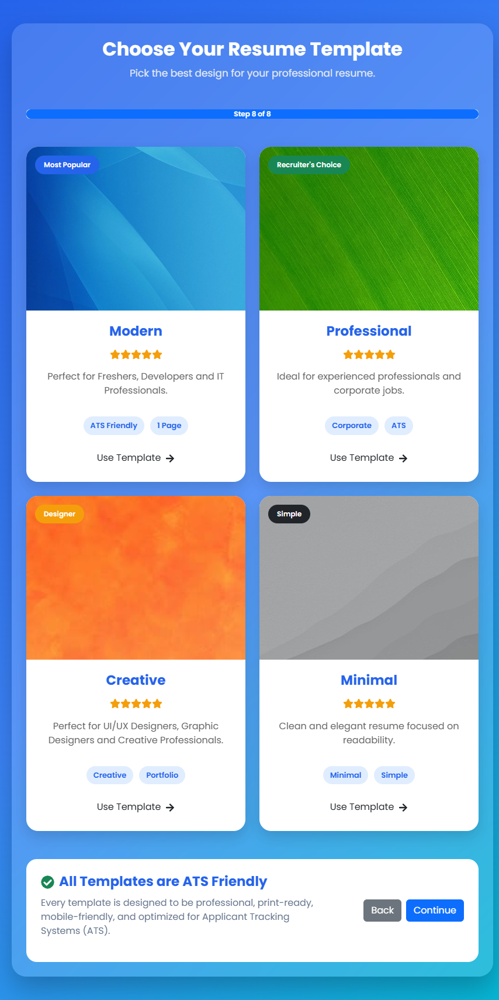

### 14. Resume Preview

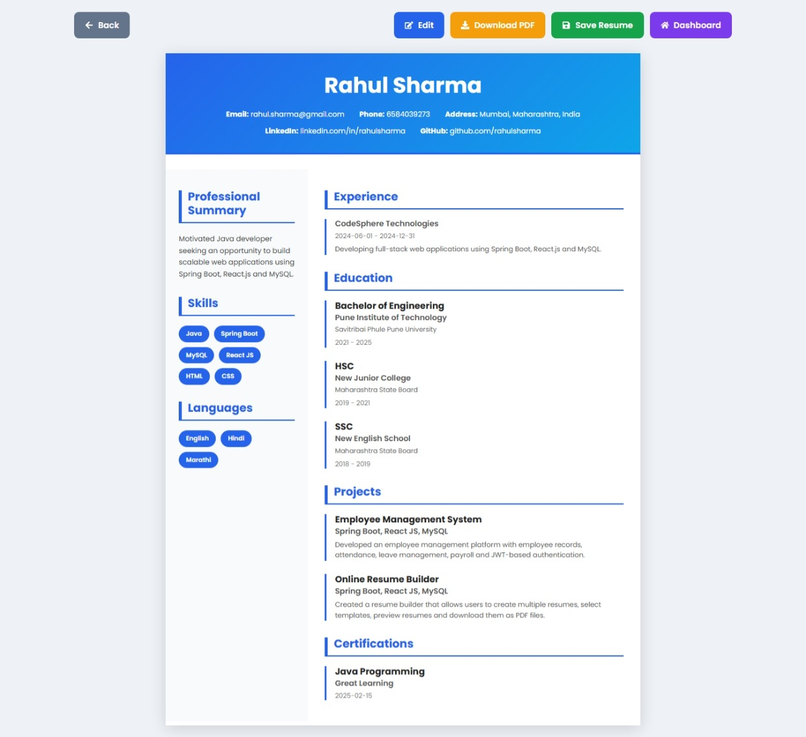